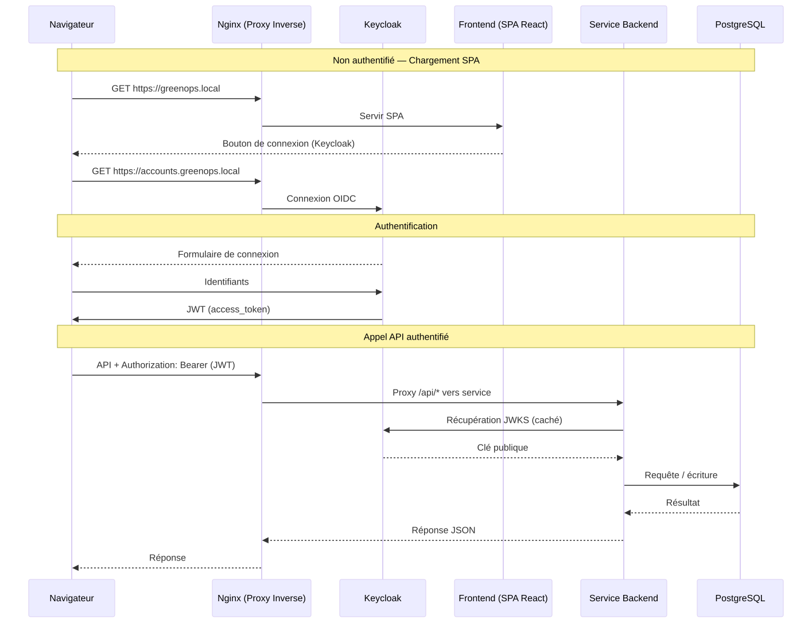

= Plateforme GreenOps — Document d'Architecture
:toc: left
:toclevels: 4
:icons: font
:sectnums:
:source-highlighter: pygments

// ---------------------------------------------------------------------------
// Métadonnées
// ---------------------------------------------------------------------------
Auteurs: Marco KUIDJA, Moussa TOURE, Wilfried MAILLET
Version: 1.0
Date: 2026-06

// ---------------------------------------------------------------------------
// 1. Vue d'ensemble du projet
// ---------------------------------------------------------------------------
== Vue d'ensemble du projet

GreenOps est une plateforme SaaS cloud-native qui surveille et visualise les
métriques de consommation énergétique. Elle démontre les pratiques DevOps
modernes :

* Architecture microservices
* Conteneurisation Docker
* Orchestration Kubernetes sur Minikube
* Observabilité avec Prometheus + Grafana
* Authentification centralisée via Keycloak
* CI/CD avec GitHub Actions
* Base de données PostgreSQL multi-schéma

=== Objectifs

* Collecter et afficher des métriques énergétiques
* Gérer les profils utilisateur et les préférences
* Générer des alertes basées sur des requêtes Prometheus
* Fournir une infrastructure conteneurisée prête pour la production
* Activer la surveillance et l'observabilité dès l'installation

// ---------------------------------------------------------------------------
// 2. Architecture globale
// ---------------------------------------------------------------------------
== Architecture globale

[horizontal]
Frontend:: SPA React servie par Nginx
Passerelle API:: Proxy inverse Nginx (point d'entrée unique)
Fournisseur d'identité:: Keycloak (OIDC / JWT)
Services backend:: alerts-service, user-service (Node.js + Express)
Base de données:: PostgreSQL (multi-schéma)
Surveillance:: Prometheus (métriques), Grafana (tableaux de bord)

=== Schéma d'architecture

=== Flux des requêtes

Correspondance des routes Nginx vers les services backend :

* `/api/alerts/*` → `alerts-service:3001`
* `/api/user/*` → `user-service:3003/profile/*`
* `/api/prometheus/*` → `prometheus:9090`

// ---------------------------------------------------------------------------
// 3. Composants
// ---------------------------------------------------------------------------
== Rôles des composants

=== Postgres

[horizontal]
Image:: `postgres:16-alpine`
Port:: `5432` (interne uniquement)
Rôle:: Base de données centrale pour tous les services.

Utilise une conception multi-schéma dans une seule base de données :

* schéma `users` — table `UserProfile` (user-service)
* schéma `alerts` — table `Alert` (alerts-service)

Le volume persistant `postgres_data` garantit la survie des données après les redémarrages.

=== Keycloak

[horizontal]
Image:: `quay.io/keycloak/keycloak:24.0`
Port:: `8080` (interne uniquement)
Rôle:: Fournisseur d'identité OpenID Connect (OIDC).

Fonctionnalités clés :

* Exposé via Nginx à `https://accounts.greenops.local`.
* Realm pré-configuré `greenops` importé depuis `infrastructure/docker/realm.json`.
* Clients : `greenops-frontend` (public) et `greenops-grafana` (confidentiel).
* Métriques activées (`KC_METRICS_ENABLED=true`) pour le scraping Prometheus.
* Les clés de signature JWT sont récupérées par les backends via l'URI JWKS.

=== Frontend

[horizontal]
Construction:: Vite + React 19 (TypeScript)
Docker:: `apps/frontend/Dockerfile` (multi-étapes, servi par Nginx)

La SPA est construite au moment de la création de l'image et servie comme
fichiers statiques par Nginx. Elle utilise `react-oidc-context` pour
l'authentification Keycloak et Axios pour les appels API. Le JWT est
automatiquement attaché par un interceptor de requêtes.

Pages :

* **Tableau de bord** — affiche le nombre d'alertes, le thème, les durées de
  scraping Prometheus et les alertes récentes dans un tableau.
* **Services** — affiche l'état en direct (actif/inactif) de tous les composants
  de l'infrastructure en interrogeant la métrique Prometheus `up`.

=== alerts-service

[horizontal]
Langage:: Node.js + Express 5 (TypeScript)
Port:: `3001`
Dockerfile:: `apps/alerts-service/Dockerfile`

API REST pour la gestion des alertes. Expose les points d'accès suivants :

* `GET /alerts` — lister toutes les alertes (les plus récentes d'abord)
* `POST /alerts` — créer une nouvelle alerte
* `PATCH /alerts/:id/read` — marquer une alerte comme lue
* `GET /health` — vérification de l'état de santé
* `GET /metrics` — métriques Prometheus (via `prom-client`)

Il exécute également un moniteur en arrière-plan (`src/monitor.ts`) qui :

. Interroge Prometheus toutes les 30 secondes pour les règles d'alerte configurées.
. Si un seuil est dépassé, crée un enregistrement `Alert` dans PostgreSQL.
. Lorsque la métrique revient à la normale, marque les alertes en attente comme lues.

Les règles d'alerte incluent la détection de service hors ligne et les
avertissements de durée de scraping élevée.

=== user-service

[horizontal]
Langage:: Node.js + Express 5 (TypeScript)
Port:: `3003`
Dockerfile:: `apps/user-service/Dockerfile`

API REST pour les profils utilisateur. Expose les points d'accès suivants :

* `GET /profile` — récupérer ou créer automatiquement le profil de l'utilisateur authentifié
* `PATCH /profile` — mettre à jour les champs du profil (thème, notifications, etc.)
* `GET /health` — vérification de l'état de santé
* `GET /metrics` — métriques Prometheus (via `prom-client`)

Les profils sont indexés par la revendication `sub` du JWT (ID utilisateur Keycloak).
Si un profil n'est pas trouvé, le service tente d'abord une recherche par email
pour gérer gracieusement les changements d'ID utilisateur Keycloak.

=== Nginx

[horizontal]
Image:: `nginx:alpine` (pour la SPA) + configuration depuis `infrastructure/docker/nginx.conf`
Ports:: `80:80`, `443:443` (+ interne `8081` pour stub_status)

Remplit quatre responsabilités :

* **Serveur de fichiers statiques** — sert la SPA React construite à `/`.
* **Proxy inverse** — achemine les chemins API vers les services backend.
* **Terminaison TLS** — termine HTTPS avec des certificats auto-signés.
* **stub_status** — expose les métriques de connexion sur le port `8081` pour nginx-exporter.

Quatre blocs serveur (trois hôtes virtuels + un interne) :

|===
| Écoute  | Nom du serveur            | Rôle
| `8081`   | `localhost`               | stub_status (interne, pour nginx-exporter)
| `80/443` | `greenops.local`          | Frontend + API
| `80/443` | `accounts.greenops.local` | Keycloak
| `80/443` | `monitor.greenops.local`  | Grafana
|===

=== nginx-exporter

[horizontal]
Image:: `nginx/nginx-prometheus-exporter:latest`
Port:: `9113` (interne)
URI de scraping:: `http://nginx:8081/stub_status`

Exposant sidecar qui lit stub_status Nginx et expose les métriques au format
Prometheus. Dans Docker Compose, il s'exécute comme un service séparé ; dans
Kubernetes, comme un conteneur sidecar dans le pod frontend.

=== Prometheus

[horizontal]
Image:: `prom/prometheus`
Port:: `9090` (interne uniquement)
Configuration:: `infrastructure/docker/prometheus.yml`

Scrape les cibles suivantes toutes les 15 secondes :

|===
| Job                    | Cible
| `prometheus`           | `localhost:9090`
| `alerts-service`       | `alerts-service:3001`
| `user-service`         | `user-service:3003`
| `postgres-exporter`    | `postgres-exporter:9187`
| `keycloak`             | `keycloak:8080/metrics`
| `nginx-exporter`       | `nginx-exporter:9113`
|===

Le frontend interroge Prometheus via le proxy Nginx pour :

* `scrape_duration_seconds` — affiché sous forme de diagrammes à barres sur le Tableau de bord.
* `up` — utilisé par la page Services pour les indicateurs d'état en direct.

=== Grafana

[horizontal]
Image:: `grafana/grafana`
Port:: `3000` (interne uniquement)
Auth:: OIDC via Keycloak (client `greenops-grafana`)

Configuré avec OAuth générique utilisant Keycloak comme fournisseur.
Grafana est accessible à `https://monitor.greenops.local`.

=== postgres-exporter

[horizontal]
Image:: `prometheuscommunity/postgres-exporter:latest`
Port:: `9187` (interne uniquement)
Rôle:: Expose les métriques PostgreSQL à Prometheus.

=== nginx-exporter

[horizontal]
Image:: `nginx/nginx-prometheus-exporter:latest`
Port:: `9113` (interne uniquement)
Rôle:: Expose les métriques de connexion Nginx à Prometheus (lus depuis stub_status sur le port `8081`).

// ---------------------------------------------------------------------------
// 4. Prise en main — Docker
// ---------------------------------------------------------------------------
== Infrastructure Docker

=== Prérequis

* Docker Engine 24+ et Docker Compose v2
* `openssl` (pour générer les certificats)
* `pnpm` (pour le développement local hors Docker)

.Exécutez les commandes suivantes depuis la racine du dépôt :
[source,bash]
----
# 1. Générer les certificats TLS auto-signés (une seule fois)
mkdir -p infrastructure/docker/certs
openssl req -x509 -nodes -days 365 -newkey rsa:2048 \
  -keyout infrastructure/docker/certs/nginx.key \
  -out    infrastructure/docker/certs/nginx.crt \
  -subj  "/CN=greenops.local" \
  -addext "subjectAltName=DNS:greenops.local,DNS:accounts.greenops.local,DNS:monitor.greenops.local"

# 2. Démarrer tous les services
docker compose -f infrastructure/docker/compose.yml up -d --build

# 3. Vérifier que tout fonctionne
docker compose -f infrastructure/docker/compose.yml ps

# 4. Suivre les journaux
docker compose -f infrastructure/docker/compose.yml logs -f
----

=== Fichier Hosts

Ajoutez les entrées suivantes à `/etc/hosts` :

[source,text]
----
127.0.0.1  greenops.local
127.0.0.1  accounts.greenops.local
127.0.0.1  monitor.greenops.local
----

=== Points d'accès

|===
| Service       | URL
| Frontend      | `https://greenops.local`
| Keycloak      | `https://accounts.greenops.local`
| Grafana       | `https://monitor.greenops.local`
|===

=== Identifiants par défaut

|===
| Service  | Nom d'utilisateur | Mot de passe
| Keycloak | `admin`           | `admin`
| Grafana  | OIDC              | (connexion via Keycloak)
|===

=== Commandes utiles

[source,bash]
----
# Reconstruire un service spécifique
docker compose -f infrastructure/docker/compose.yml up -d --build <service>

# Voir les journaux d'un service
docker compose -f infrastructure/docker/compose.yml logs -f <service>

# Tout arrêter
docker compose -f infrastructure/docker/compose.yml down

# Arrêter et supprimer les volumes (départ à zéro)
docker compose -f infrastructure/docker/compose.yml down -v

# Exécuter une commande dans un conteneur
docker compose -f infrastructure/docker/compose.yml exec <service> <command>
----

// ---------------------------------------------------------------------------
// 5. Variables d'environnement
// ---------------------------------------------------------------------------
== Configuration

=== Variables d'environnement

|===
| Variable             | Valeur par défaut                  | Service(s)
| `DATABASE_URL`       | `postgresql://greenops:...`        | alerts-service, user-service
| `PORT`               | `3001` / `3003`                    | alerts-service, user-service
| `KEYCLOAK_JWKS_URI`  | `http://keycloak:8080/...`         | alerts-service, user-service
| `PROMETHEUS_URL`     | `http://prometheus:9090`           | alerts-service
|===

=== Schémas de base de données

Les deux services se connectent à la même base de données `greenops_db` en
utilisant des schémas PostgreSQL distincts :

[source,sql]
----
-- Schéma : users (user-service)
CREATE SCHEMA IF NOT EXISTS users;

CREATE TABLE users."UserProfile" (
    id              UUID PRIMARY KEY DEFAULT gen_random_uuid(),
    "keycloakId"    TEXT NOT NULL UNIQUE,
    email           TEXT NOT NULL UNIQUE,
    theme           TEXT NOT NULL DEFAULT 'light',
    notifications   BOOLEAN NOT NULL DEFAULT true,
    "dashboardLayout" JSONB,
    "createdAt"     TIMESTAMPTZ NOT NULL DEFAULT now(),
    "updatedAt"     TIMESTAMPTZ NOT NULL DEFAULT now()
);

-- Schéma : alerts (alerts-service)
CREATE SCHEMA IF NOT EXISTS alerts;

CREATE TYPE alerts."Severity" AS ENUM ('info', 'warning', 'critical');

CREATE TABLE alerts."Alert" (
    id              UUID PRIMARY KEY DEFAULT gen_random_uuid(),
    title           TEXT NOT NULL,
    description     TEXT NOT NULL,
    severity        alerts."Severity" NOT NULL DEFAULT 'info',
    "metricName"    TEXT NOT NULL,
    "metricValue"   DOUBLE PRECISION NOT NULL,
    threshold       DOUBLE PRECISION NOT NULL,
    "isRead"        BOOLEAN NOT NULL DEFAULT false,
    "createdAt"     TIMESTAMPTZ NOT NULL DEFAULT now()
);
----

// ---------------------------------------------------------------------------
// 6. CI/CD
// ---------------------------------------------------------------------------
== Pipelines CI/CD

=== CI — Qualité du code

Déclenché sur push / pull request vers `main` ou `master`.

. `pnpm install --frozen-lockfile`
. `pnpm biome ci .` — vérifications lint et format
. `pnpm --filter shared run build` — compiler le package de types partagés
. `pnpm --filter alerts-service exec prisma generate && pnpm --filter alerts-service exec tsc --noEmit` — vérification de types alerts-service
. `pnpm --filter user-service exec prisma generate && pnpm --filter user-service exec tsc --noEmit` — vérification de types user-service
. `pnpm --filter frontend exec tsc --noEmit` — vérification de types frontend

NOTE : alerts-service et user-service partagent le même `@prisma/client` dans le
store pnpm. Chaque `prisma generate` écrase les modèles de l'autre, ils doivent
donc être vérifiés séquentiellement, en régénérant Prisma juste avant chaque
vérification.

=== Publication — Images Docker

Déclenché sur push vers `main` / `master` ou tag correspondant à `v*`.

Publie trois images sur le GitHub Container Registry (GHCR) :

|===
| Image                            | Dockerfile
| `ghcr.io/<org>/green-ops/frontend` | `apps/frontend/Dockerfile`
| `ghcr.io/<org>/green-ops/alerts-service` | `apps/alerts-service/Dockerfile`
| `ghcr.io/<org>/green-ops/user-service` | `apps/user-service/Dockerfile`
|===

Tags : `latest` (branche), `sha-<short>` (toujours), semver (tags).

// ---------------------------------------------------------------------------
// 7. Structure du dépôt
// ---------------------------------------------------------------------------
== Structure du dépôt

[source,text]
----
.
├── .github/workflows/
│   ├── ci.yml                  # Lint, vérification de types
│   └── publish.yml             # Construction et publication des images Docker vers GHCR
├── apps/
│   ├── alerts-service/         # API REST Alertes + moniteur Prometheus
│   ├── frontend/               # SPA React (Vite)
│   └── user-service/           # API REST Profils utilisateur
├── infrastructure/
│   ├── docker/
│   │   ├── certs/              # Certificats TLS (ignorés par git)
│   │   ├── compose.yml         # Définition Docker Compose
│   │   ├── nginx.conf          # Configuration du proxy inverse Nginx (Docker)
│   │   ├── prometheus.yml      # Configuration de scraping Prometheus (Docker)
│   │   └── realm.json          # Import du realm Keycloak (Docker)
│   └── k8s/
│       ├── 00-namespace.yml    # Namespace greenops
│       ├── 01-secrets.yml      # Définitions des secrets (valeurs depuis deploy.sh)
│       ├── 02-configmaps.yml   # Placeholder (ConfigMaps créés par deploy.sh)
│       ├── 03-postgres.yml     # PostgreSQL + postgres-exporter
│       ├── 04-keycloak.yml     # Keycloak (+ configuration CORS)
│       ├── 05-prometheus.yml   # Prometheus
│       ├── 06-grafana.yml      # Grafana
│       ├── 07-alerts-service.yml  # API Alertes
│       ├── 08-user-service.yml    # API Profils utilisateur
│       ├── 09-frontend.yml     # Frontend (nginx + SPA)
│       ├── 10-redis.yml          # Cache Redis
│       ├── 11-hpa-alerts.yml      # HPA pour alerts-service
│       ├── 12-hpa-user.yml        # HPA pour user-service
│       ├── 13-hpa-frontend.yml    # HPA pour frontend
│       ├── deploy.sh           # Déploiement Minikube en une commande
│       ├── nginx.conf          # Configuration Nginx (version K8s)
│       ├── prometheus.yml      # Configuration Prometheus (version K8s)
│       └── realm.json          # Import du realm Keycloak (version K8s)
├── packages/
│   └── shared/                 # Schémas Zod partagés, middleware JWT
├── docs/
│   ├── architecture-fr.adoc    # Ce document
│   └── grafana-dashboards/     # JSON des tableaux de bord Grafana prêts à l'emploi
├── pnpm-workspace.yaml         # Configuration de l'espace de travail pnpm
├── package.json                # Scripts racine (lint, build, vérification de types)
├── tsconfig.json               # Configuration TypeScript de base
└── biome.json                  # Configuration Biome (linter + formateur)
----

// ---------------------------------------------------------------------------
// 8. Kubernetes
// ---------------------------------------------------------------------------
== Kubernetes (Minikube)

Le projet inclut un déploiement Kubernetes complet pour Minikube dans
`infrastructure/k8s/`. Il reflète l'architecture Docker Compose et utilise
les mêmes images distantes depuis GHCR.

=== Architecture

Dans la configuration K8s, le proxy inverse Nginx s'exécute en tant que
conteneur dans le pod `frontend` (même image que Docker), avec sa
configuration depuis `infrastructure/k8s/nginx.conf` montée en tant que
ConfigMap. Le service LoadBalancer l'expose à l'extérieur.

=== Namespace

Toutes les ressources sont déployées dans un seul namespace :

[source,text]
----
greenops
----

=== Déploiements

[cols="1,1,1,1,1"]
|===
| Déploiement        | Image                                | Port  | Répliques | Sonde de préparation
| frontend           | ghcr.io/.../frontend:latest          | 443   | 2 (HPA)   | —
| alerts-service     | ghcr.io/.../alerts-service:latest    | 3001  | 2 (HPA)   | `GET /health`
| user-service       | ghcr.io/.../user-service:latest      | 3003  | 2 (HPA)   | `GET /health`
| postgres           | postgres:16-alpine                   | 5432  | 1         | `pg_isready`
| postgres-exporter  | prometheuscommunity/postgres-exporter | 9187 | 1        | —
| keycloak           | quay.io/keycloak/keycloak:24.0       | 8080  | 1         | —
| prometheus         | prom/prometheus                      | 9090  | 1         | —
| grafana            | grafana/grafana                      | 3000  | 1         | —
|===

NOTE: Les services critiques (frontend, alerts-service, user-service) sont configurés
avec une base de 2 répliques et peuvent être mis à l'échelle automatiquement de 2 à 5
répliques via Horizontal Pod Autoscaler (HPA) selon l'utilisation CPU/mémoire.

=== Services

|===
| Service            | Type         | Port(s)
| frontend           | LoadBalancer | 443, 80
| alerts-service     | ClusterIP    | 3001
| user-service       | ClusterIP    | 3003
| postgres           | ClusterIP    | 5432
| postgres-exporter  | ClusterIP    | 9187
| keycloak           | ClusterIP    | 8080
| prometheus         | ClusterIP    | 9090
| grafana            | ClusterIP    | 3000
|===

Le LoadBalancer `frontend` est le seul point d'entrée externe. `minikube tunnel`
achemine l'IP du LoadBalancer vers l'hôte.

=== Horizontal Pod Autoscalers

Les Horizontal Pod Autoscalers (HPA) permettent une mise à l'échelle automatique
des services critiques en fonction de l'utilisation des ressources :

[cols="1,1,1,1,1"]
|===
| HPA                  | Cible             | Min | Max | Seuils (CPU/Mém)
| alerts-service-hpa   | alerts-service    | 2   | 5   | 70% / 80%
| user-service-hpa     | user-service      | 2   | 5   | 70% / 80%
| frontend-hpa         | frontend          | 2   | 5   | 70% / 80%
|===

Fonctionnement :

* **Scale-up** : Déclenché automatiquement quand l'utilisation CPU dépasse 70%
* **Scale-down** : Réduction progressive quand l'utilisation chute sous les seuils
* **Haute disponibilité** : Minimum 2 répliques garanties pour les services critiques

==== Configuration des ressources

Chaque déploiement avec HPA inclut des demandes (requests) et limites de ressources :

[source,yaml]
----
resources:
  requests:
    cpu: 100m      # 100 millicores
    memory: 128Mi  # 128 MiB
  limits:
    cpu: 500m      # 500 millicores
    memory: 512Mi  # 512 MiB
----

Ces limites permettent au planificateur Kubernetes de placer efficacement les pods
et à l'HPA de fonctionner correctement.

==== Prérequis

L'HPA nécessite le serveur de métriques (Metrics Server) dans le cluster :

[source,bash]
----
# Activer l'addon metrics-server dans Minikube
minikube addons enable metrics-server
----

==== Vérification

[source,bash]
----
# Lister tous les HPA
kubectl get hpa -n greenops

# Détails d'un HPA spécifique
kubectl describe hpa alerts-service-hpa -n greenops

# Surveiller la mise à l'échelle en temps réel
kubectl get hpa -n greenops -w
----

=== ConfigMaps

Les ConfigMaps sont créés à partir de fichiers de configuration K8s autonomes
dans `infrastructure/k8s/` (séparés des versions Docker dans `infrastructure/docker/`) :

|===
| ConfigMap          | Fichier source                     | Chemin de montage
| `nginx-config`     | `infrastructure/k8s/nginx.conf`    | `/etc/nginx/conf.d/default.conf`
| `prometheus-config` | `infrastructure/k8s/prometheus.yml` | `/etc/prometheus/prometheus.yml`
| `keycloak-realm`   | `infrastructure/k8s/realm.json`    | `/opt/keycloak/data/import/realm.json`
|===

La configuration Nginx (`infrastructure/k8s/nginx.conf`) achemine par hôte virtuel :

|===
| Nom d'hôte                    | Route               | Backend
| `greenops.local`              | `/api/alerts/*`     | `alerts-service:3001`
| `greenops.local`              | `/api/user/*`       | `user-service:3003`
| `greenops.local`              | `/api/prometheus/*` | `prometheus:9090`
| `greenops.local`              | `/` (fichiers statiques) | frontend SPA
| `accounts.greenops.local`     | `/`                 | `keycloak:8080`
| `monitor.greenops.local`      | `/`                 | `grafana:3000`
|===

=== Secrets

|===
| Secret              | Contenu
| `greenops-secrets`  | `postgres-user`, `postgres-password`, `postgres-db`, `grafana-client-secret`
| `nginx-tls`         | `nginx.crt`, `nginx.key` (auto-signés, générés au déploiement)
|===

==== Certificats TLS

Contrairement à Docker (qui conserve les certificats dans `infrastructure/docker/certs/`),
K8s génère des certificats auto-signés au moment du déploiement en utilisant
`openssl` et les stocke dans un Secret `kubernetes.io/tls`. Les certificats ne
sont jamais commités dans le dépôt.

=== Stockage

PostgreSQL utilise une PersistentVolumeClaim :

[source,yaml]
----
apiVersion: v1
kind: PersistentVolumeClaim
metadata:
  name: postgres-pvc
  namespace: greenops
spec:
  accessModes:
    - ReadWriteOnce
  resources:
    requests:
      storage: 1Gi
----

=== CORS Keycloak

La SPA frontend (`https://greenops.local`) effectue des requêtes de découverte
OIDC vers Keycloak (`https://accounts.greenops.local`), ce qui constitue une
requête cross-origin. Keycloak est configuré avec le support CORS :

[source,yaml]
----
env:
  - name: KC_HTTP_CORS_ALLOWED_ORIGINS
    value: "https://greenops.local"
  - name: KC_HTTP_CORS_ALLOWED_METHODS
    value: "GET,POST,PUT,PATCH,DELETE,OPTIONS"
  - name: KC_HTTP_CORS_ALLOWED_HEADERS
    value: "Authorization,Content-Type,X-Requested-With,Origin"
  - name: KC_HTTP_CORS_EXPOSED_HEADERS
    value: "WWW-Authenticate"
----

=== Déploiement

Le script `deploy.sh` gère le déploiement complet :

[source,bash]
----
bash infrastructure/k8s/deploy.sh
----

Ce que fait le script :

. Génère des certificats TLS auto-signés
. Démarre Minikube si nécessaire (pilote Docker, 2 CPU, 4 Go RAM)
. Crée le namespace `greenops`
. Crée les ConfigMaps à partir des fichiers de configuration `infrastructure/k8s/*`
. Crée un Secret TLS pour nginx
. Applique tous les manifestes dans l'ordre (PostgreSQL → Keycloak → Prometheus → services → frontend)
. Applique les configurations Horizontal Pod Autoscaler
. Attend que tous les pods atteignent l'état `Ready`
. Affiche les instructions de connexion

==== Post-déploiement

[source,bash]
----
# Démarrer le tunnel LoadBalancer
minikube tunnel

# Obtenir l'IP LoadBalancer attribuée
kubectl get svc frontend -n greenops
# NAME       TYPE           CLUSTER-IP     EXTERNAL-IP     PORT(S)
# frontend   LoadBalancer   10.107.80.138  10.107.80.138   443:31109/TCP,80:31448/TCP

# Ajouter à /etc/hosts (utiliser l'EXTERNAL-IP ci-dessus)
# 10.107.80.138  greenops.local
# 10.107.80.138  accounts.greenops.local
# 10.107.80.138  monitor.greenops.local
----

==== Vérification

[source,bash]
----
# Vérifier que tous les pods sont en cours d'exécution
kubectl get pods -n greenops

# Vérifier les Horizontal Pod Autoscalers
kubectl get hpa -n greenops

# Tester la SPA frontend
curl -sk https://greenops.local/ | head -5
# <!DOCTYPE html><html lang="en">...

# Tester le proxy API (attend JWT — retournera une erreur d'auth)
curl -sk https://greenops.local/api/alerts/alerts
# {"success":false,"error":"Authorization header missing"}

# Tester Prometheus via le proxy
curl -sk https://greenops.local/api/prometheus/-/ready
# Prometheus Server is Ready.

# Tester la découverte OIDC Keycloak
curl -sk https://accounts.greenops.local/realms/greenops/.well-known/openid-configuration
# {"issuer":"https://accounts.greenops.local/realms/greenops",...}

# Tester le pré-vol CORS
curl -sk -X OPTIONS -H "Origin: https://greenops.local" \
  -H "Access-Control-Request-Method: GET" \
  https://accounts.greenops.local/realms/greenops/.well-known/openid-configuration
# Access-Control-Allow-Origin: https://greenops.local
----

=== Différences avec Docker

|===
| Aspect              | Docker                               | K8s
| Fichiers de config  | `infrastructure/docker/`             | `infrastructure/k8s/` (suivi séparé)
| Certificats         | Persistants dans `certs/` (commités) | Générés au déploiement (non commités)
| Point d'entrée      | `compose.yml`                        | `deploy.sh`
| Service frontend    | Mapping de ports dans compose        | LoadBalancer + `minikube tunnel`
| Terminaison TLS     | Nginx dans le conteneur frontend     | Identique (configuration via ConfigMap)
| Découverte de services | DNS Docker (nom du service)       | DNS K8s (même nom, même namespace)
| Données PostgreSQL  | Volume nommé `postgres_data`         | PVC `postgres-pvc` (1 Go)
|===

=== Identifiants par défaut

|===
| Service  | Nom d'utilisateur | Mot de passe
| Keycloak | `admin`           | `admin`
| Keycloak | `marco.kuidja`    | `user1password`
| Grafana  | OIDC              | (connexion via Keycloak)
|===
