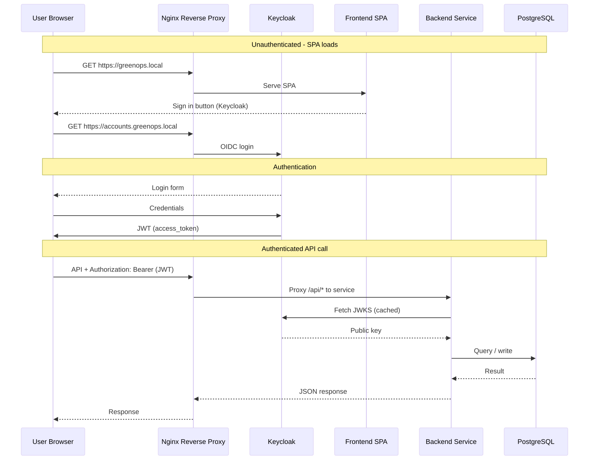

= GreenOps Platform — Architecture Document
:toc: left
:toclevels: 4
:icons: font
:sectnums:
:source-highlighter: pygments

// ---------------------------------------------------------------------------
// Metadata
// ---------------------------------------------------------------------------
Authors: Marco KUIDJA, Moussa TOURE, Wilfried MAILLET
Version: 1.0
Date: 2026-06

// ---------------------------------------------------------------------------
// 1. Project Overview
// ---------------------------------------------------------------------------
== Project Overview

GreenOps is a cloud-native SaaS platform that monitors and visualizes energy
consumption metrics. It demonstrates modern DevOps practices:

* Microservices architecture
* Docker containerization
* Kubernetes orchestration on Minikube
* Observability with Prometheus + Grafana
* Centralized authentication via Keycloak
* CI/CD with GitHub Actions
* Multi-schema PostgreSQL database

=== Objectives

* Collect and display energy metrics
* Manage user profiles and preferences
* Generate alerts based on Prometheus queries
* Provide a production-ready, containerized infrastructure
* Enable monitoring and observability out of the box

// ---------------------------------------------------------------------------
// 2. Global Architecture
// ---------------------------------------------------------------------------
== Global Architecture

[horizontal]
Frontend:: React SPA served by Nginx
API Gateway:: Nginx reverse proxy (single entry point)
Identity Provider:: Keycloak (OIDC / JWT)
Backend Services:: alerts-service, user-service (Node.js + Express)
Database:: PostgreSQL (multi-schema)
Monitoring:: Prometheus (metrics), Grafana (dashboards)

=== Architecture Diagram

=== Request Flow

Route mapping from Nginx to backend services:

* `/api/alerts/*` → `alerts-service:3001`
* `/api/user/*` → `user-service:3003/profile/*`
* `/api/prometheus/*` → `prometheus:9090`

// ---------------------------------------------------------------------------
// 3. Components
// ---------------------------------------------------------------------------
== Component Roles

=== Postgres

[horizontal]
Image:: `postgres:16-alpine`
Port:: `5432` (internal only)
Purpose:: Central database for all services.

Uses a multi-schema design within a single database:

* schema `users` — `UserProfile` table (user-service)
* schema `alerts` — `Alert` table (alerts-service)

Persistent volume `postgres_data` ensures data survives restarts.

=== Keycloak

[horizontal]
Image:: `quay.io/keycloak/keycloak:24.0`
Port:: `8080` (internal only)
Purpose:: OpenID Connect (OIDC) identity provider.

Key features:

* Exposed via Nginx at `https://accounts.greenops.local`.
* Pre-configured realm `greenops` imported from `infrastructure/docker/realm.json`.
* Clients: `greenops-frontend` (public) and `greenops-grafana` (confidential).
* Metrics enabled (`KC_METRICS_ENABLED=true`) for Prometheus scraping.
* JWT signing keys are fetched by backends via the JWKS URI.

=== Frontend

[horizontal]
Build:: Vite + React 19 (TypeScript)
Docker:: `apps/frontend/Dockerfile` (multi-stage, served by Nginx)

The SPA is built at image creation time and served as static files by Nginx.
It uses `react-oidc-context` for Keycloak authentication and Axios for API
calls. The JWT is automatically attached by a request interceptor.

Pages:

* **Dashboard** — shows alert count, theme, Prometheus scrape durations, and
  recent alerts in a table.
* **Services** — displays live up/down status of all infrastructure components
  by querying the Prometheus `up` metric.

=== alerts-service

[horizontal]
Language:: Node.js + Express 5 (TypeScript)
Port:: `3001`
Dockerfile:: `apps/alerts-service/Dockerfile`

REST API for managing alerts. Exposes the following endpoints:

* `GET /alerts` — list all alerts (most recent first)
* `POST /alerts` — create a new alert
* `PATCH /alerts/:id/read` — mark an alert as read
* `GET /health` — health check
* `GET /metrics` — Prometheus metrics (via `prom-client`)

It also runs a background monitor (`src/monitor.ts`) that:

. Queries Prometheus every 30 seconds for configured alert rules.
. If a threshold is breached, creates an `Alert` record in PostgreSQL.
. When the metric recovers, marks pending alerts as read.

Alert rules include service-down detection and high scrape duration warnings.

=== user-service

[horizontal]
Language:: Node.js + Express 5 (TypeScript)
Port:: `3003`
Dockerfile:: `apps/user-service/Dockerfile`

REST API for user profiles. Exposes the following endpoints:

* `GET /profile` — fetch or auto-create the authenticated user's profile
* `PATCH /profile` — update profile fields (theme, notifications, etc.)
* `GET /health` — health check
* `GET /metrics` — Prometheus metrics (via `prom-client`)

Profiles are keyed by the `sub` claim from the JWT (Keycloak user ID).
If a profile is not found, the service attempts a lookup by email first to
handle Keycloak user-ID changes gracefully.

=== Nginx

[horizontal]
Image:: `nginx:alpine` (for the SPA) + config from `infrastructure/docker/nginx.conf`
Ports:: `80:80`, `443:443` (+ internal `8081` for stub_status)

Serves four responsibilities:

* **Static file server** — serves the built React SPA at `/`.
* **Reverse proxy** — routes API paths to backend services.
* **TLS termination** — terminates HTTPS with self-signed certificates.
* **stub_status** — exposes connection metrics on port `8081` for nginx-exporter.

Four server blocks (three virtual hosts + one internal):

|===
| Listen   | Server Name             | Purpose
| `8081`   | `localhost`             | stub_status (internal, for nginx-exporter)
| `80/443` | `greenops.local`        | Frontend + API
| `80/443` | `accounts.greenops.local` | Keycloak
| `80/443` | `monitor.greenops.local`  | Grafana
|===

=== nginx-exporter

[horizontal]
Image:: `nginx/nginx-prometheus-exporter:latest`
Port:: `9113` (internal)
Scrape URI:: `http://nginx:8081/stub_status`

Sidecar/exporter that reads Nginx stub_status and exposes Prometheus-formatted
metrics at `/metrics`. In Docker Compose it runs as a separate service; in
Kubernetes it runs as a sidecar container in the frontend pod.

=== Prometheus

[horizontal]
Image:: `prom/prometheus`
Port:: `9090` (internal only)
Config:: `infrastructure/docker/prometheus.yml`

Scrapes the following targets every 15 seconds:

|===
| Job                    | Target                      | Metrics
| `prometheus`           | `localhost:9090`            | Self-metrics
| `alerts-service`       | `alerts-service:3001`       | Node.js (CPU, memory, event loop, handles)
| `user-service`         | `user-service:3003`         | Node.js (CPU, memory, event loop, handles)
| `postgres-exporter`    | `postgres-exporter:9187`    | PostgreSQL (connections, size, cache)
| `keycloak`             | `keycloak:8080/metrics`     | JVM (heap, threads, GC, CPU)
| `nginx`                | `nginx-exporter:9113`       | Nginx connections, request rate
|===

The frontend queries Prometheus through the Nginx proxy for:

* `scrape_duration_seconds` — displayed as bar charts on the Dashboard.
* `up` — used by the Services page for live status indicators.

=== Grafana

[horizontal]
Image:: `grafana/grafana`
Port:: `3000` (internal only)
Auth:: OIDC via Keycloak (`greenops-grafana` client)

Configured with generic OAuth using Keycloak as the provider.
Grafana is accessed at `https://monitor.greenops.local`.

==== Auto-provisioning

Grafana is fully auto-configured on startup — no manual setup required:

|===
| Config                         | Source
| Prometheus datasource          | `infrastructure/grafana/provisioning/datasources/datasource.yml`
| Dashboard loader               | `infrastructure/grafana/provisioning/dashboards/dashboard-provider.yml`
| Dashboard JSON                 | `infrastructure/grafana/dashboards/greenops-overview.json`
|===

==== Dashboard: GreenOps — Service Overview

The provisioned dashboard contains 12 panels:

|===
| # | Panel                  | Key Query                                              | Source
| 1 | Service Health         | `up{job=~"$job"}`                                       | All targets
| 2 | Memory Usage           | `process_resident_memory_bytes`                          | Node.js
| 3 | Heap Utilization       | `nodejs_heap_size_used_bytes / nodejs_heap_size_total_bytes` | Node.js
| 4 | CPU Usage              | `rate(process_cpu_user_seconds_total[1m])`               | Node.js
| 5 | Event Loop Lag         | `nodejs_eventloop_lag_seconds`                           | Node.js
| 6 | Active Requests        | `nodejs_active_requests_total`                           | Node.js
| 7 | Postgres Overview      | `pg_stat_activity_count`, `pg_database_size_bytes`       | PostgreSQL
| 8 | Scrape Duration        | `scrape_duration_seconds` (table)                        | Prometheus
| 9 | Nginx Connections      | `nginx_connections_active / reading / writing / waiting`  | Nginx
|10 | Nginx Request Rate     | `rate(nginx_http_requests_total[1m])`                    | Nginx
|11 | Keycloak JVM Heap      | `jvm_memory_used_bytes`, `jvm_memory_max_bytes`          | Keycloak
|12 | Keycloak CPU & Threads | `system_cpu_usage`, `jvm_threads_live_threads`           | Keycloak
|===

=== Redis

[horizontal]
Image:: `redis:7-alpine`
Port:: `6379` (internal only)
Purpose:: Caching, rate limiting, and alert deduplication.

Three use cases:

* **Profile cache** (user-service) — caches user profiles for 5 minutes; invalidated on update.
* **Rate limiting** (both services) — 100 requests/minute per client using `express-rate-limit` + `rate-limit-redis`.
* **Alert dedup** (alerts-service monitor) — prevents duplicate alert creation within configurable TTLs via `SET NX EX` (critical=10min, warning=5min, info=2min).

The Redis client (`ioredis`) uses `lazyConnect: true` so the server starts
before Redis is available. Connection failures are logged but don't block the
service.

=== postgres-exporter

[horizontal]
Image:: `prometheuscommunity/postgres-exporter:latest`
Port:: `9187` (internal only)
Purpose:: Exposes PostgreSQL metrics to Prometheus.

// ---------------------------------------------------------------------------
// 4. Getting Started — Docker
// ---------------------------------------------------------------------------
== Docker Infrastructure

=== Prerequisites

* Docker Engine 24+ and Docker Compose v2
* `openssl` (to generate certificates)
* `pnpm` (for local development outside Docker)

.Run the following from the repository root:
[source,bash]
----
# 1. Generate self-signed TLS certificates (one time only)
mkdir -p infrastructure/docker/certs
openssl req -x509 -nodes -days 365 -newkey rsa:2048 \
  -keyout infrastructure/docker/certs/nginx.key \
  -out    infrastructure/docker/certs/nginx.crt \
  -subj  "/CN=greenops.local" \
  -addext "subjectAltName=DNS:greenops.local,DNS:accounts.greenops.local,DNS:monitor.greenops.local"

# 2. Start all services
docker compose -f infrastructure/docker/compose.yml up -d --build

# 3. Check that everything is running
docker compose -f infrastructure/docker/compose.yml ps

# 4. Follow logs
docker compose -f infrastructure/docker/compose.yml logs -f
----

=== Hosts File

Add the following entries to `/etc/hosts`:

[source,text]
----
127.0.0.1  greenops.local
127.0.0.1  accounts.greenops.local
127.0.0.1  monitor.greenops.local
----

=== Access Points

|===
| Service       | URL
| Frontend      | `https://greenops.local`
| Keycloak      | `https://accounts.greenops.local`
| Grafana       | `https://monitor.greenops.local`
|===

=== Default Credentials

|===
| Service  | Username | Password
| Keycloak | `admin`  | `admin`
| Grafana  | OIDC     | (login via Keycloak)
|===

=== Useful Commands

[source,bash]
----
# Rebuild a single service
docker compose -f infrastructure/docker/compose.yml up -d --build <service>

# View logs for a service
docker compose -f infrastructure/docker/compose.yml logs -f <service>

# Stop everything
docker compose -f infrastructure/docker/compose.yml down

# Stop and remove volumes (fresh start)
docker compose -f infrastructure/docker/compose.yml down -v

# Run a command inside a container
docker compose -f infrastructure/docker/compose.yml exec <service> <command>
----

// ---------------------------------------------------------------------------
// 5. Environment Variables
// ---------------------------------------------------------------------------
== Configuration

=== Environment Variables

|===
| Variable             | Default                          | Service(s)
| `DATABASE_URL`       | `postgresql://greenops:...`      | alerts-service, user-service
| `PORT`               | `3001` / `3003`                  | alerts-service, user-service
| `KEYCLOAK_JWKS_URI`  | `http://keycloak:8080/...`       | alerts-service, user-service
| `PROMETHEUS_URL`     | `http://prometheus:9090`         | alerts-service
| `REDIS_URL`          | `redis://:password@redis:6379`   | alerts-service, user-service
| `REDIS_HOST`         | `redis`                          | alerts-service, user-service (K8s)
| `REDIS_PORT`         | `6379`                           | alerts-service, user-service (K8s)
| `REDIS_PASSWORD`     | _(from secret)_                  | alerts-service, user-service (K8s)
|===

=== Database Schemas

Both services connect to the same `greenops_db` database using distinct
PostgreSQL schemas:

[source,sql]
----
-- Schema: users (user-service)
CREATE SCHEMA IF NOT EXISTS users;

CREATE TABLE users."UserProfile" (
    id              UUID PRIMARY KEY DEFAULT gen_random_uuid(),
    "keycloakId"    TEXT NOT NULL UNIQUE,
    email           TEXT NOT NULL UNIQUE,
    theme           TEXT NOT NULL DEFAULT 'light',
    notifications   BOOLEAN NOT NULL DEFAULT true,
    "dashboardLayout" JSONB,
    "createdAt"     TIMESTAMPTZ NOT NULL DEFAULT now(),
    "updatedAt"     TIMESTAMPTZ NOT NULL DEFAULT now()
);

-- Schema: alerts (alerts-service)
CREATE SCHEMA IF NOT EXISTS alerts;

CREATE TYPE alerts."Severity" AS ENUM ('info', 'warning', 'critical');

CREATE TABLE alerts."Alert" (
    id              UUID PRIMARY KEY DEFAULT gen_random_uuid(),
    title           TEXT NOT NULL,
    description     TEXT NOT NULL,
    severity        alerts."Severity" NOT NULL DEFAULT 'info',
    "metricName"    TEXT NOT NULL,
    "metricValue"   DOUBLE PRECISION NOT NULL,
    threshold       DOUBLE PRECISION NOT NULL,
    "isRead"        BOOLEAN NOT NULL DEFAULT false,
    "createdAt"     TIMESTAMPTZ NOT NULL DEFAULT now()
);
----

// ---------------------------------------------------------------------------
// 6. CI/CD
// ---------------------------------------------------------------------------
== CI/CD Pipelines

=== CI — Code Quality

Triggered on push / pull request to `main` or `master`.

. `pnpm install --frozen-lockfile`
. `pnpm biome ci .` — lint and format checks
. `pnpm --filter shared run build` — compile the shared types package
. `pnpm --filter alerts-service exec prisma generate && pnpm --filter alerts-service exec tsc --noEmit` — type-check alerts-service
. `pnpm --filter user-service exec prisma generate && pnpm --filter user-service exec tsc --noEmit` — type-check user-service
. `pnpm --filter frontend exec tsc --noEmit` — type-check frontend

NOTE: alerts-service and user-service share the same `@prisma/client` in the pnpm
store. Each `prisma generate` overwrites the other's models, so they must be
type-checked sequentially, regenerating Prisma immediately before each check.

=== Publish — Docker Images

Triggered on push to `main` / `master` or tag matching `v*`.

Publishes three images to GitHub Container Registry (GHCR):

|===
| Image                            | Dockerfile
| `ghcr.io/<org>/green-ops/frontend` | `apps/frontend/Dockerfile`
| `ghcr.io/<org>/green-ops/alerts-service` | `apps/alerts-service/Dockerfile`
| `ghcr.io/<org>/green-ops/user-service` | `apps/user-service/Dockerfile`
|===

Tags: `latest` (branch), `sha-<short>` (always), semver (tags).

// ---------------------------------------------------------------------------
// 7. Repository Structure
// ---------------------------------------------------------------------------
== Repository Layout

[source,text]
----
.
├── .github/workflows/
│   ├── ci.yml                  # Lint, type-check
│   └── publish.yml             # Build & push Docker images to GHCR
├── apps/
│   ├── alerts-service/         # Alert REST API + Prometheus monitor
│   ├── frontend/               # React SPA (Vite)
│   └── user-service/           # User profile REST API
├── infrastructure/
│   ├── docker/
│   │   ├── certs/              # TLS certificates (gitignored)
│   │   ├── compose.yml         # Docker Compose definition
│   │   ├── nginx.conf          # Nginx reverse proxy config (Docker)
│   │   ├── prometheus.yml      # Prometheus scrape config (Docker)
│   │   └── realm.json          # Keycloak realm import (Docker)
│   ├── grafana/
│   │   ├── dashboards/
│   │   │   └── greenops-overview.json  # Provisioned dashboard (12 panels)
│   │   └── provisioning/
│   │       ├── datasources/
│   │       │   └── datasource.yml      # Prometheus datasource
│   │       └── dashboards/
│   │           └── dashboard-provider.yml  # Dashboard loader
│   └── k8s/
│       ├── 00-namespace.yml    # greenops namespace
│       ├── 01-secrets.yml      # Secret definitions (values from deploy.sh)
│       ├── 02-configmaps.yml   # Placeholder (ConfigMaps created by deploy.sh)
│       ├── 03-postgres.yml     # PostgreSQL + postgres-exporter
│       ├── 04-keycloak.yml     # Keycloak (+ CORS config)
│       ├── 05-prometheus.yml   # Prometheus
│       ├── 06-grafana.yml      # Grafana + provisioning volume mounts
│       ├── 07-alerts-service.yml  # Alert API
│       ├── 08-user-service.yml    # User profile API
│       ├── 09-frontend.yml     # Frontend (nginx + nginx-exporter sidecar)
│       ├── 10-redis.yml        # Redis (PVC + Deployment + Service)
│       ├── deploy.sh           # One-command Minikube deployment
│       ├── nginx.conf          # Nginx config (K8s version, includes stub_status)
│       ├── prometheus.yml      # Prometheus config (K8s version, includes nginx target)
│       └── realm.json          # Keycloak realm import (K8s version)
├── packages/
│   └── shared/                 # Shared Zod schemas, JWT auth middleware
├── docs/
│   └── architecture.adoc       # This document
├── pnpm-workspace.yaml         # Monorepo workspace config
├── package.json                # Root scripts (lint, build, type-check)
├── tsconfig.json               # Base TypeScript config
└── biome.json                  # Biome (linter + formatter) config
----

// ---------------------------------------------------------------------------
// 8. Kubernetes
// ---------------------------------------------------------------------------
== Kubernetes (Minikube)

The project includes a complete Kubernetes deployment for Minikube under
`infrastructure/k8s/`. It mirrors the Docker Compose architecture and uses
the same remote images from GHCR.

=== Architecture

In the K8s setup, the Nginx reverse proxy runs as a container in the `frontend`
pod (same image as Docker), with its config from `infrastructure/k8s/nginx.conf`
mounted as a ConfigMap. The LoadBalancer service exposes it externally.

=== Namespace

All resources are deployed in a single namespace:

[source,text]
----
greenops
----

=== Deployments

[cols="1,1,1,1"]
|===
| Deployment         | Image                                | Port(s) | Readiness Probe
| frontend           | ghcr.io/.../frontend:latest          | 443, 80 | —
| _nginx-exporter_   | _nginx/nginx-prometheus-exporter_    | _9113_  | _(sidecar)_
| alerts-service     | ghcr.io/.../alerts-service:latest    | 3001    | `GET /health`
| user-service       | ghcr.io/.../user-service:latest      | 3003    | `GET /health`
| postgres           | postgres:16-alpine                   | 5432    | `pg_isready`
| postgres-exporter  | prometheuscommunity/postgres-exporter | 9187    | —
| keycloak           | quay.io/keycloak/keycloak:24.0       | 8080    | —
| redis              | redis:7-alpine                       | 6379    | `redis-cli ping`
| prometheus         | prom/prometheus                      | 9090    | —
| grafana            | grafana/grafana                      | 3000    | —
|===

=== Services

|===
| Service            | Type         | Port(s)               | Purpose
| frontend           | LoadBalancer | 443, 80, 9113          | External entry + nginx metrics
| alerts-service     | ClusterIP    | 3001                  | Internal API
| user-service       | ClusterIP    | 3003                  | Internal API
| postgres           | ClusterIP    | 5432                  | Database
| postgres-exporter  | ClusterIP    | 9187                  | Metrics
| keycloak           | ClusterIP    | 8080                  | OIDC provider
| redis              | ClusterIP    | 6379                  | Cache / Rate limiting
| prometheus         | ClusterIP    | 9090                  | Metrics
| grafana            | ClusterIP    | 3000                  | Dashboards
|===

The `frontend` LoadBalancer is the sole external entry point. `minikube tunnel`
routes the LoadBalancer IP to the host.

=== ConfigMaps

ConfigMaps are created from standalone K8s config files in `infrastructure/k8s/`
(separate from the Docker versions in `infrastructure/docker/`):

|===
| ConfigMap                   | Source File                                          | Mount Path
| `nginx-config`              | `infrastructure/k8s/nginx.conf`                      | `/etc/nginx/conf.d/default.conf`
| `prometheus-config`         | `infrastructure/k8s/prometheus.yml`                  | `/etc/prometheus/prometheus.yml`
| `keycloak-realm`            | `infrastructure/k8s/realm.json`                      | `/opt/keycloak/data/import/realm.json`
| `grafana-datasource`        | `infrastructure/grafana/provisioning/datasources/datasource.yml` | `/etc/grafana/provisioning/datasources/datasource.yml`
| `grafana-dashboard-provider`| `infrastructure/grafana/provisioning/dashboards/dashboard-provider.yml` | `/etc/grafana/provisioning/dashboards/dashboard-provider.yml`
| `grafana-dashboard`         | `infrastructure/grafana/dashboards/greenops-overview.json` | `/etc/grafana/dashboards/greenops-overview.json`
|===

The nginx config (`infrastructure/k8s/nginx.conf`) routes by virtual host:

|===
| Hostname                    | Route               | Backend
| `greenops.local`            | `/api/alerts/*`     | `alerts-service:3001`
| `greenops.local`            | `/api/user/*`       | `user-service:3003`
| `greenops.local`            | `/api/prometheus/*` | `prometheus:9090`
| `greenops.local`            | `/` (static files)  | frontend SPA
| `accounts.greenops.local`   | `/`                 | `keycloak:8080`
| `monitor.greenops.local`    | `/`                 | `grafana:3000`
|===

=== Secrets

|===
| Secret              | Contents
| `greenops-secrets`  | `postgres-user`, `postgres-password`, `postgres-db`, `redis-password`, `grafana-client-secret`
| `nginx-tls`         | `nginx.crt`, `nginx.key` (self-signed, generated at deploy time)
|===

==== TLS Certificates

Unlike Docker (which persists certs in `infrastructure/docker/certs/`), K8s
generates self-signed certificates at deploy time using `openssl` and stores
them in a `kubernetes.io/tls` Secret. The certificates are never committed to
the repository.

=== Storage

PostgreSQL uses a PersistentVolumeClaim:

[source,yaml]
----
apiVersion: v1
kind: PersistentVolumeClaim
metadata:
  name: postgres-pvc
  namespace: greenops
spec:
  accessModes:
    - ReadWriteOnce
  resources:
    requests:
      storage: 1Gi
----

=== Keycloak CORS

The frontend SPA (`https://greenops.local`) makes OIDC discovery requests to
Keycloak (`https://accounts.greenops.local`), which is a cross-origin request.
Keycloak is configured with CORS support:

[source,yaml]
----
env:
  - name: KC_HTTP_CORS_ALLOWED_ORIGINS
    value: "https://greenops.local"
  - name: KC_HTTP_CORS_ALLOWED_METHODS
    value: "GET,POST,PUT,PATCH,DELETE,OPTIONS"
  - name: KC_HTTP_CORS_ALLOWED_HEADERS
    value: "Authorization,Content-Type,X-Requested-With,Origin"
  - name: KC_HTTP_CORS_EXPOSED_HEADERS
    value: "WWW-Authenticate"
----

=== Deployment

The `deploy.sh` script handles the full deployment:

[source,bash]
----
bash infrastructure/k8s/deploy.sh
----

What the script does:

. Generates self-signed TLS certificates
. Starts Minikube if needed (Docker driver, 2 CPU, 4 GB RAM)
. Creates the `greenops` namespace
. Creates ConfigMaps from `infrastructure/k8s/*` config files
. Creates a TLS Secret for nginx
. Applies all manifests in order (PostgreSQL → Keycloak → Prometheus → services → frontend)
. Waits for all pods to reach `Ready` state
. Prints connection instructions

==== Post-deployment

[source,bash]
----
# Start the LoadBalancer tunnel
minikube tunnel

# Get the assigned LoadBalancer IP
kubectl get svc frontend -n greenops
# NAME       TYPE           CLUSTER-IP     EXTERNAL-IP     PORT(S)
# frontend   LoadBalancer   10.107.80.138  10.107.80.138   443:31109/TCP,80:31448/TCP

# Add to /etc/hosts (use the EXTERNAL-IP from above)
# 10.107.80.138  greenops.local
# 10.107.80.138  accounts.greenops.local
# 10.107.80.138  monitor.greenops.local
----

==== Verification

[source,bash]
----
# Check all pods are running
kubectl get pods -n greenops

# Test the frontend SPA
curl -sk https://greenops.local/ | head -5
# <!DOCTYPE html><html lang="en">...

# Test API proxy (expects JWT — will return auth error)
curl -sk https://greenops.local/api/alerts/alerts
# {"success":false,"error":"Authorization header missing"}

# Test Prometheus through proxy
curl -sk https://greenops.local/api/prometheus/-/ready
# Prometheus Server is Ready.

# Test Keycloak OIDC discovery
curl -sk https://accounts.greenops.local/realms/greenops/.well-known/openid-configuration
# {"issuer":"https://accounts.greenops.local/realms/greenops",...}

# Test CORS preflight
curl -sk -X OPTIONS -H "Origin: https://greenops.local" \
  -H "Access-Control-Request-Method: GET" \
  https://accounts.greenops.local/realms/greenops/.well-known/openid-configuration
# Access-Control-Allow-Origin: https://greenops.local
----

=== Differences from Docker

|===
| Aspect              | Docker                               | K8s
| Config files        | `infrastructure/docker/`             | `infrastructure/k8s/` (separate tracking)
| Grafana provisioning| Mounted from `infrastructure/grafana/` | ConfigMaps from same source
| Certificates        | Persistent in `certs/` (committed)   | Generated at deploy time (not committed)
| Entry point         | `compose.yml`                        | `deploy.sh`
| Frontend service    | Port mapping in compose              | LoadBalancer + `minikube tunnel`
| Nginx metrics       | Separate `nginx-exporter` service    | Sidecar container in frontend pod
| TLS termination     | Nginx in frontend container          | Same (config via ConfigMap)
| Service discovery   | Docker DNS (service name)            | K8s DNS (same name, same namespace)
| PostgreSQL data     | Named volume `postgres_data`         | PVC `postgres-pvc` (1 GiB)
| Redis               | `redis:7-alpine` service             | PVC + Deployment + Service
|===

=== Default Credentials

|===
| Service  | Username | Password
| Keycloak | `admin`  | `admin`
| Keycloak | `marco.kuidja` | `user1password`
| Grafana  | OIDC     | (login via Keycloak)
|===
